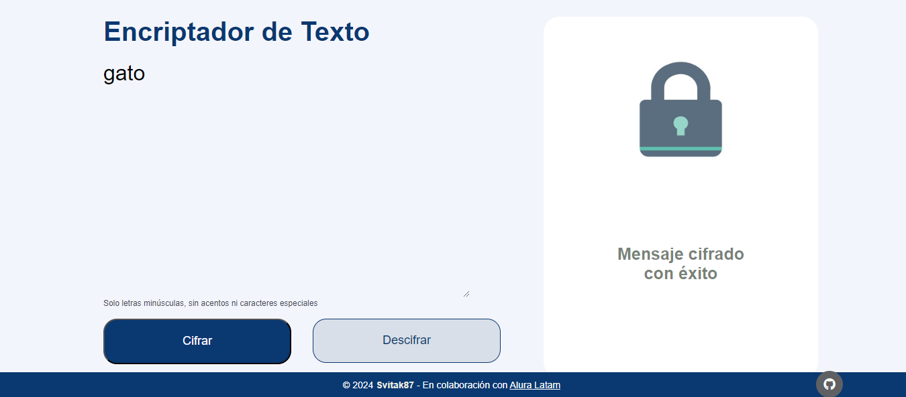
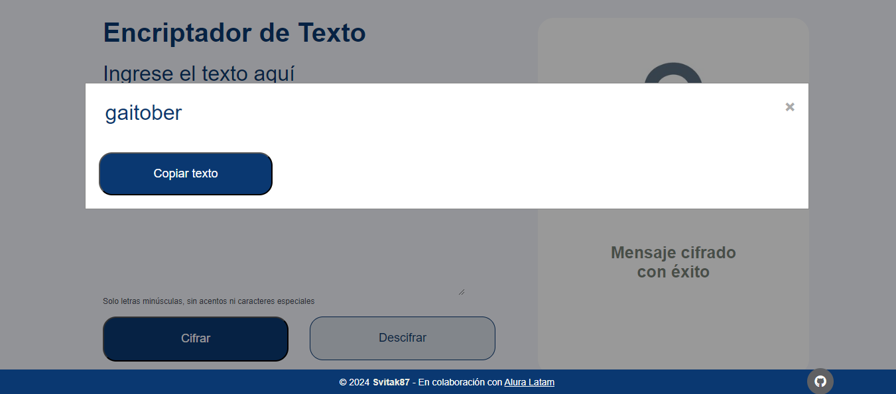

<h1> Challenge Encriptador de texto </h1>

¡Bienvenido al Encriptador de Texto de Alura Latam! Esta aplicación, desarrollada con HTML, CSS y JavaScript, 
está diseñada para ayudarte a cifrar y descifrar tus mensajes de manera segura y sencilla. Ya sea que necesites proteger 
información sensible o simplemente divertirte con la criptografía, esta aplicación te ofrece una experiencia intuitiva y eficiente. 
¡Comienza a encriptar y descifrar textos ahora mismo y lleva tu lógica de programación al siguiente nivel!

Les comparto unas imágenes sobre cómo se ve la aplicación:

<h2>Incio de aplicación</h2>

<h2>Ingresa el texto a encriptar y aprieta el botón cifrar</h2>

<h2>Aparecerá un Pop-up con el texto encriptado y la opción de copiarlo en el portapapeles</h2>

*Cuando seleccionas el botón 'copiar texto', desaparecerá el Pop-up

¡IMPORTANTE! Con el texto ya copiado, se repite el proceso ingresando el texto haciendo con el teclado: 'Ctrl + v'; pero haciendo click en el botón 'Descifrar'

<h2>A tener en cuenta... La aplicación NO acepta minúsculas, caracteres especiales o con acentos.</h2>

<h2>Tecnologías utilizadas:</h2>
<ul>
    <li>HTML</li>
    <li>CSS</li>
    <li>Javascript</li>
</ul>

<h2>Descarga y uso del proyecto</h2>

  Para descargar y ejecutar este proyecto localmente, sigue los siguientes pasos:

<ol>
  <li>
    Clona este repositorio en tu máquina local usando el siguiente comando en tu terminal:
    <pre><code>git clone https://github.com/svitak87/encriptador_alura.git</code></pre>
  </li>
  <li>
    Abre el archivo <code>index.html</code> con Live Server. Si no tienes Live Server instalado, puedes agregarlo como una extensión en Visual Studio Code.
  </li>
  <li>
    Para abrir el proyecto con Live Server en Visual Studio Code, sigue estos pasos:
    <ul>
      <li>Abre Visual Studio Code y navega hasta la carpeta del proyecto.</li>
      <li>Haz clic derecho en el archivo <code>index.html</code> y selecciona <code>Open with Live Server</code>.</li>
    </ul>
  </li>
  <li>
    Tu navegador se abrirá automáticamente mostrando la aplicación encriptadora de texto.
  </li>
</ol>

## Licencia

Este proyecto está licenciado bajo la Licencia MIT.

